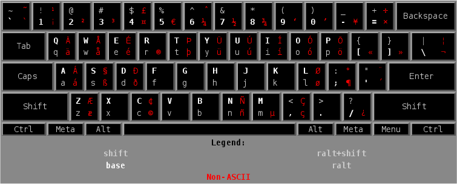
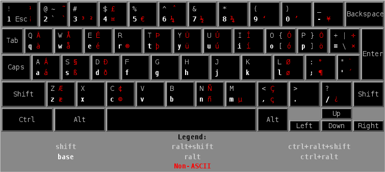

### US AltGr International Keyboard for Android

This package contains additional layout files for physical keyboards (i.e. USB,
Bluetooth) to enable the "AltGr" variant of the US International keyboard layout
on Android.

These layouts are also known as "us altgr-intl" or "US Extended".

### The Layouts

The layouts are based on the existing English (US International) layouts, with
the following changes:

- All key combinations defined in English (US) behave like in English (US).
- International characters conflicting with English (US) have been moved
  to require AltGr.
- Affected keys: ` and 6.

In case of the Pixel C variant, the following additional changes were done:

- ² has been moved to AltGr-Ctrl-3 as AltGr-Ctrl-2 is already taken.
- International characters conflicting with English (US) that use AltGr (the ...
  key) have been moved to require Ctrl.
- Affected keys: 1, 2, 3, 6, O, P, =.

#### English (US AltGr International)



#### English (US AltGr International; Pixel C)



### Compiling & Installing

```
android update project -p .
ant debug
adb install bin/USAltGrIntl-debug.apk
```

In case of a Pixel C, additionally run one of:

```
adb shell pm disable-user com.android.dragonkeyboard
```

After that, to to Settings / Language & input / Physical keyboard and select the
keyboard layouts from this package. They will show up as layouts provided by
"US AltGr International External Keyboard Layout".

Pixel C users: to go back to using the layouts included with the device, run one
of:

```
adb shell pm enable com.android.dragonkeyboard
```

### Compiling & Installing on the device

[Termux](https://play.google.com/store/apps/details?id=com.termux) users
who are comfortable with installing from "unknown sources" can now compile
and install _on_ the device (note that this is substantially less secure,
at the very least make sure no other apps are running):

```
./compile-and-install-from-termux.sh
```

Unfortunately this procedure does not support the Pixel C; above `adb shell`
command absolutely must be run from a computer connected via USB first.

### Adding Your Own

To add a custom layout:

1. Download one of the existing layout files from
   [AOSP](https://android.googlesource.com/platform/frameworks/base/+/master/packages/InputDevices/res/raw)
   or
   [Pixel C](https://android.googlesource.com/device/google/dragon/+/marshmallow-dr-dragon-release/DragonKeyboard/res/raw/).
1. Edit and rename the file as needed. Some ideas:
   1. You can change the symbols on a key by simply editing the `key` blocks in
      the file. Should be quite self-explaining.
   1. You can remap/swap keys by adding lines of the sort
      `map key <scancode> <keyname>`, where the scancode and keyname come from
      [Generic.kl](https://android.googlesource.com/platform/frameworks/base/+/master/data/keyboards/Generic.kl).
1. Save it below `res/raw/` in this repository.
1. Duplicate and edit one of the existing entries below
   [keyboard\_layouts.xml](res/xml/keyboard_layouts.xml) according to the new file name.
1. Duplicate and edit one of the existing entries in
   [strings.xml](res/values/strings.xml) according to the new file name.
1. Compile and install as above.

### Copyright

See the `LICENSE` file.

### Contributing

See the `CONTRIBUTING.md` file.

### Disclaimer

This is not an official Google product.
